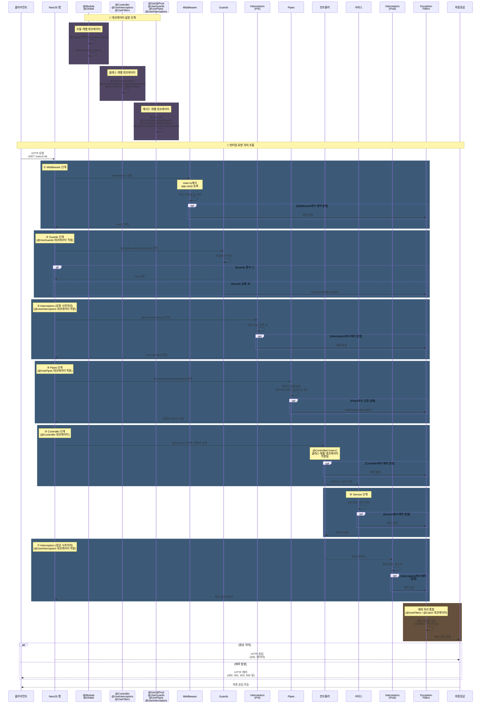

---

## 📌 데코레이터 적용 가이드

### **모듈 레벨 데코레이터**

```typescript
@Global()  // 전역 범위로 설정
@Module({
  providers: [
    {
      provide: APP_FILTER,
      useClass: GlobalExceptionFilter,  // 모든 요청에 적용
    },
    {
      provide: APP_INTERCEPTOR,
      useClass: GlobalLoggingInterceptor,
    },
    {
      provide: APP_GUARD,
      useClass: GlobalAuthGuard,
    },
  ],
})
export class AppModule {}
```

### **클래스 레벨 데코레이터**

```typescript
@UseFilters(ExceptionFilter)  // 이 컨트롤러의 모든 라우트
@UseInterceptors(LoggingInterceptor)  // 이 컨트롤러의 모든 라우트
@Controller('users')
export class UsersController {
  // ...
}
```

### **메서드 레벨 데코레이터**

```typescript
@UseGuards(AuthGuard)  // 이 메서드만
@UsePipes(new ValidationPipe())  // 이 메서드만
@UseInterceptors(CustomInterceptor)  // 이 메서드만
@Get(':id')
async getUser(@Param('id') id: string) {
  return this.usersService.findById(id);
}
```

---

## 🔗 데코레이터 적용 범위 (우선순위 역순)

| 적용 범위 | 우선순위 | 설명 |
|---------|---------|------|
| **메서드** | 1순위 (높음) | 가장 구체적, 해당 메서드에만 적용 |
| **클래스** | 2순위 | 해당 컨트롤러의 모든 메서드에 적용 |
| **모듈** | 3순위 | 전역(@Global) 또는 제한된 범위 |

---

## 💡 실전 완전 예제

```typescript
// =========== app.module.ts ===========
@Global()
@Module({
  providers: [
    {
      provide: APP_FILTER,
      useClass: GlobalExceptionFilter,  // 모든 요청의 예외 처리
    },
    {
      provide: APP_INTERCEPTOR,
      useClass: GlobalLoggingInterceptor,
    },
  ],
})
export class AppModule {}

// =========== users.controller.ts ===========
@UseFilters(CustomExceptionFilter)  // 클래스 레벨
@UseInterceptors(TransformInterceptor)  // 클래스 레벨
@Controller('users')
export class UsersController {
  constructor(private usersService: UsersService) {}

  @Get(':id')
  @UseGuards(AuthGuard)  // 메서드 레벨 - 인증 검사
  @UsePipes(new ValidationPipe())  // 메서드 레벨 - 데이터 검증
  @UseInterceptors(CacheInterceptor)  // 메서드 레벨 - 캐싱
  async getUser(@Param('id') id: string) {
    // 실행 순서:
    // 1. Global Guards (모듈 레벨)
    // 2. @UseGuards(AuthGuard) - 메서드 레벨
    // 3. Global Interceptors Pre
    // 4. @UseInterceptors(CacheInterceptor) - 메서드 레벨 Pre
    // 5. @UsePipes(ValidationPipe) - 메서드 레벨
    // 6. Controller 메서드 실행
    // 7. Service 로직
    // 8. @UseInterceptors(CacheInterceptor) - 메서드 레벨 Post
    // 9. Global Interceptors Post
    
    return this.usersService.findById(id);
  }
}

// =========== global-exception.filter.ts ===========
@Catch()  // 모든 예외 처리
@Injectable()
export class GlobalExceptionFilter implements ExceptionFilter {
  catch(exception: Exception, host: ArgumentsHost) {
    const response = host.switchToHttp().getResponse();
    const status = exception instanceof HttpException 
      ? exception.getStatus() 
      : 500;
    
    response.status(status).json({
      statusCode: status,
      message: exception.message,
      timestamp: new Date().toISOString(),
    });
  }
}
```

---

## 🎯 데코레이터 적용 우선순위

```
모듈 레벨 데코레이터 (가장 먼저 적용)
    ↓
클래스 레벨 데코레이터
    ↓
메서드 레벨 데코레이터 (가장 나중에 적용, 가장 높은 우선순위)
```
