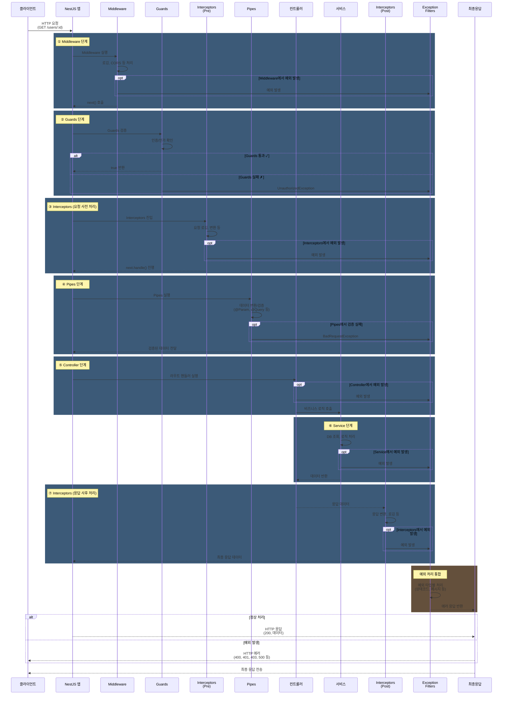

### NestJS 요청 처리 프로세스 순서

1. **Request (요청 수신)**  
   - 클라이언트의 HTTP 요청이 NestJS 애플리케이션에 도착 (URL, 메서드, 헤더, 바디 등 포함).

2. **Middleware (미들웨어)**  
   - 요청을 가로채어 전처리(로깅, 인증, 요청 수정 등)를 수행.  
   - **구현 예시**:

    ```typescript
     import { Injectable, NestMiddleware } from '@nestjs/common';
     import { Request, Response, NextFunction } from 'express';

     @Injectable()
     class LoggerMiddleware implements NestMiddleware {
       use(req: Request, res: Response, next: NextFunction) {
         console.log(`[${new Date().toISOString()}] ${req.method} ${req.url}`);
         next(); // 다음 미들웨어 또는 단계로 이동
       }
     }

     // 모듈에 미들웨어 적용
     import { Module, NestModule, MiddlewareConsumer } from '@nestjs/common';
     @Module({})
     export class AppModule implements NestModule {
       configure(consumer: MiddlewareConsumer) {
         consumer.apply(LoggerMiddleware).forRoutes('*'); // 모든 경로에 적용
       }
     }
     ```

3. **Guards (가드)**  
   - 요청의 인증/권한을 확인하여 라우트 접근을 제어.  
   - 예: `AuthGuard`로 JWT 토큰 검증.

4. **Interceptors (인터셉터)**  
   - 요청/응답을 가로채어 변환, 로깅, 캐싱 등 수행.  
   - **구현 예시**:

     ```typescript
     import { Injectable, NestInterceptor, ExecutionContext, CallHandler } from '@nestjs/common';
     import { Observable } from 'rxjs';
     import { map } from 'rxjs/operators';

     @Injectable()
     export class TransformInterceptor implements NestInterceptor {
       intercept(context: ExecutionContext, next: CallHandler): Observable<any> {
         return next.handle().pipe(
           tap(data => {
             console.log('✅ TransformInterceptor: 응답 데이터 변환');
           }),
           map(data => ({
             statusCode: context.switchToHttp().getResponse().statusCode,
             data, // 응답 데이터에 메타데이터 추가
             timestamp: new Date().toISOString(),
           })),
         );
       }
     }

     // 컨트롤러에 적용
     @UseInterceptors(TransformInterceptor)
     @Get('example')
     getExample() {
       return { message: 'Hello, World!' };
     }

     ```

     글로벌 적용: `app.useGlobalInterceptors(new LoggingInterceptor());`

5. **Pipes (파이프)**  
   - 요청 데이터의 유효성 검사 및 변환.  
   - **구현 예시**:

     ```typescript
     import { PipeTransform, Injectable, BadRequestException } from '@nestjs/common';

     @Injectable()
     export class CustomValidationPipe implements PipeTransform {
       transform(value: any) {
         if (typeof value !== 'string' || value.length < 3) {
           throw new BadRequestException('Value must be a string with at least 3 characters');
         }
         return value.toUpperCase(); // 변환 예시
       }
     }

     // 컨트롤러에 적용
     @Get(':name')
     getByName(@Param('name', CustomValidationPipe) name: string) {
       return { name };
     }
     ```

6. **Param Decorators (파라미터 데코레이터)**  
   - `@Param()`, `@Body()`, `@Query()` 등을 사용해 요청 데이터 추출.  
   - 예: `@Param('id') id: string`.

7. **Controller (컨트롤러)**  
   - 요청을 처리하고 서비스 호출.  
   - 예:
     ```typescript
     @Controller('users')
     export class UserController {
       constructor(private userService: UserService) {}
       @Get(':id')
       getUser(@Param('id') id: string) {
         return this.userService.findById(id);
       }
     }
     ```

8. **Service (서비스)**  
   - 비즈니스 로직 처리.  
   - 예: `UserService`에서 데이터베이스 조회.

9. **Interceptors (인터셉터 - 응답 처리)**  
   - 응답 데이터를 후처리 (위 `TransformInterceptor` 예시 참조).

10. **Exception Filters (예외 필터)**  
    - 예외를 처리하여 사용자 정의 에러 응답 생성.  
    - 예:
      ```typescript
      import { ExceptionFilter, Catch, ArgumentsHost, HttpException } from '@nestjs/common';

      @Catch(HttpException)
      export class HttpExceptionFilter implements ExceptionFilter {
        catch(exception: HttpException, host: ArgumentsHost) {
          const ctx = host.switchToHttp();
          const response = ctx.getResponse();
          const status = exception.getStatus();
          response.status(status).json({
            statusCode: status,
            message: exception.message,
            timestamp: new Date().toISOString(),
          });
        }
      }
      ```

11. **Response (응답 전송)**  
    - 최종 응답이 클라이언트로 전송 (HTTP 상태 코드와 데이터 포함).

### 요약 다이어그램

```
Request
   ↓
Middleware (예: LoggerMiddleware)
   ↓
Guards (예: AuthGuard)
   ↓
Interceptors (Pre, 예: TransformInterceptor)
   ↓
Pipes (예: CustomValidationPipe)
   ↓
Param Decorators
   ↓
Controller
   ↓
Service
   ↓
Interceptors (Post)
   ↓
Exception Filters (예: HttpExceptionFilter)
   ↓
Response
```

### 참고

- 위 예시는 간단한 구현을 보여주며, 실제로는 더 복잡한 로직을 포함할 수 있습니다.  
- Middleware, Interceptors, Pipes는 글로벌 또는 특정 경로/컨트롤러에 적용 가능.  



---

## 📋 개선된 다이어그램의 주요 특징

### **1. 모든 단계에서 예외 처리******
- 각 단계별 `opt` (optional) 블록으로 예외 발생 경로 명시
- **모든 예외가 Exception Filters로 수렴**

### **2. Interceptors의 감싸는 구조**
- **(Pre) Interceptors**: 요청 사전 처리
- **(Post) Interceptors**: 응답 사후 처리
- 요청 → 응답을 감싸는 구조로 표현

### **3. 명확한 단계 구분**
- 7가지 단계를 색상 구분 (rect)으로 시각화
- 각 단계의 목적을 노트(note)로 표시

### **4. 예외 처리의 일관성**
- Exception Filters가 **중앙집중식으로 모든 예외 처리**
- 최종적으로 클라이언트에게 HTTP 에러 반환

---

## 💡 실제 동작 예제

```typescript
// 각 단계에서 예외 처리되는 예

@UseInterceptors(LoggingInterceptor)
@Controller('users')
export class UsersController {
  constructor(private usersService: UsersService) {}

  @Get(':id')
  @UseGuards(AuthGuard)  // ② Guards 단계에서 실패 가능
  @UsePipes(new ValidationPipe())  // ④ Pipes에서 검증 실패 가능
  async getUser(@Param('id') id: string) {
    // ⑤ Controller 또는 ⑥ Service에서 예외 발생 가능
    return this.usersService.findById(id);
  }
}

@Catch()  // ⑦ 모든 예외를 처리
@Injectable()
export class GlobalExceptionFilter implements ExceptionFilter {
  catch(exception: Exception, host: ArgumentsHost) {
    const response = host.switchToHttp().getResponse();
    const status = exception instanceof HttpException 
      ? exception.getStatus() 
      : 500;
    
    response.status(status).json({
      statusCode: status,
      message: exception.message,
      timestamp: new Date().toISOString(),
    });
  }
}
```

---

## 🎯 다이어그램으로 이해하기

| 단계 | 목적 | 예외 처리 |
|------|------|---------|
| ① Middleware | 공통 처리 (로깅, CORS) | Exception Filters |
| ② Guards | 접근 제어 (인증/인가) | Exception Filters |
| ③ Interceptors (Pre) | 요청 전처리 | Exception Filters |
| ④ Pipes | 데이터 검증/변환 | Exception Filters |
| ⑤ Controller | 라우트 핸들러 | Exception Filters |
| ⑥ Service | 비즈니스 로직 | Exception Filters |
| ⑦ Interceptors (Post) | 응답 후처리 | Exception Filters |

---

## 🚀 고급 개발자 팁

- **Exception Filters는 전역(Global)으로 설정**하는 것이 권장됨
- **Interceptors는 Observable 기반**이므로 RxJS 이해 필수
- **순서 변경 불가**: Middleware → Guards → Interceptors → Pipes → Controller
- **예외 발생 시점** 파악이 디버깅의 핵심
